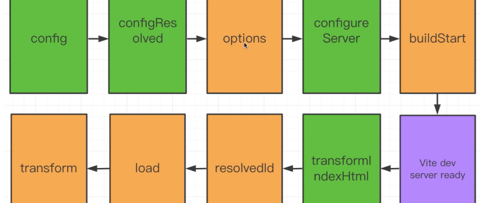

#vite2 + vue3

###官方地址 https://www.pipipi.net/vite/

项目搭建
`npm init @vitejs/app`

- vue2工程创建
- 主要变化总结（对比vite1）
  - 配置选项变化：vue特有选项、创建选项、css选项、jsx选项等
  - 别名行为变化：不再要求/开头或结尾
  - Vue支持：通过`@vitejs/plugin-vue`插件支持
  - React支持
  - HMR API支持
  - 清单格式变化
  - 插件API重新设计（基于rollup，对rollup插件的扩展和兼容）
- 项目基础架构搭建

- 路由
- 状态管理
- 样式组织
- UI库-element3
- 基础布局
- 动态导航
- 数据服务
  - mock插件：`vite-plugin-mock` `mockjs`
    地址：https://github.com/anncwb/vite-plugin-mock
    
    ```bash
    npm i mockjs -S
    npm i vite-plugin-mock cross-env -D
    ```
    配置
    
    ```js
    viteMockServe({ supportTs: false })
    ```
    
    package.json
    
    ```
    "dev": "cross-env NODE_ENV=development vite",
    ```
    
    
  
- 复杂业务处理

- 项目打包
- 部署


#vite插件开发

获得
- 深入理解vite工作机制
- 实现vite现在不能做的任务
- 为下一步做好准备：Rollup
- 掌握源码学习方法
- 架构师必备知识

内容
- vite2插件机制解读
- 插件的形式
- 插件钩子
- 插件执行顺序

###Vite插件是什么？
使用Vite插件k可以扩展Vite能力，比如解析用户自定义的文件输入，在打包代码转换前转译代码，或者查找第三方模块
浏览器 <---> vite devServer【（user plugin）（vite core plugin）（user plugin）】
vite不需要打包，通过服务端渲染

###Vite插件的形式
Vite插件扩展自Rollup插件接口，只是额外多了一些Vite特有选项
Vite插件是一个拥有名称、创建钩子（build hook）或者生成钩子（output generate hook）的对象
如果需要配置函数，应该是一个接收插件选项，返回插件对象的函数

###插件钩子函数
####通用钩子
开发时，`Vite dev server`创建一个插件容器按照`Rollup`调用创建钩子的规则请求各个钩子函数
- 下面钩子会在服务器启动时调用一次：
    - `options` 替换或操纵`Rollup`选项（一般用于打包）
    - `buildStart` 开始创建
- 下面钩子每次有模块请求时都会被调用：
    - `resolveId` 创建自定义确认函数，常用于定位第三方依赖
    - `load` 创建自定义加载函数，可用于返回自定义的内容
    - `transform` 可用于转换已加载的模块内容
- 下面钩子会在服务器关闭时调用一次
    - `buildEnd`
    - `closeBundle`

####Vite特有钩子
- config：修改Vite配置
- configResolved：Vite配置确认
- configureServer：用于配置dev server（node connect服务器实例）
- transformIndexHtml：用于转换宿主页
- handleHotUpdate：自定义HMR更新时调用


